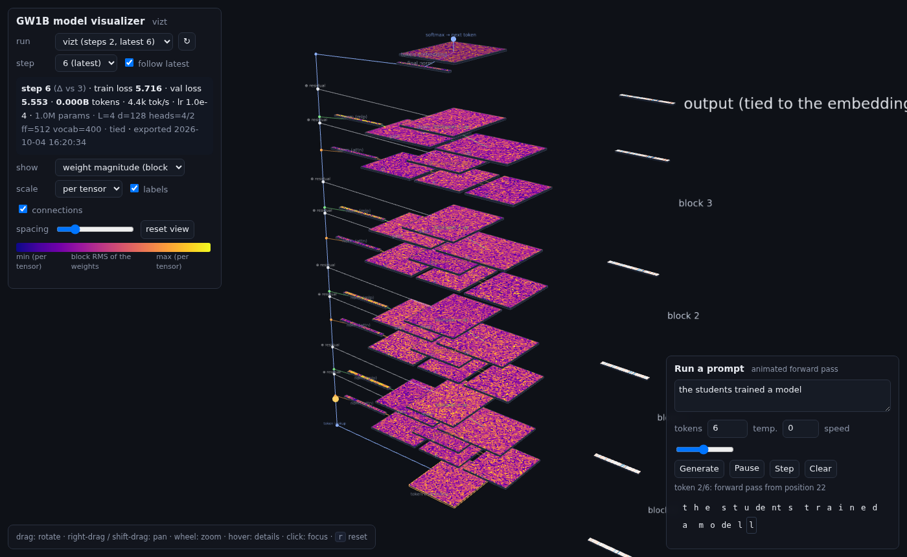

# The 3D model visualizer

An interactive view of a trained (or training) GW1B model in the spirit of [bbycroft.net/llm](https://bbycroft.net/llm):
the architecture as a tower of slabs — token embedding at the bottom, one group per transformer block (norm · Q K V ·
O · norm · gate up · down), final norm and output head on top — with every slab coloured by the **actual weights of a
checkpoint**, the **data flow** between them (the residual stream and the operations that feed it), and an **animated
forward pass** of any prompt: token by token, the activations travel from the embedding through every block to the
next-token distribution. Rotate, pan and zoom; hover a slab for its shape, statistics, histogram and a magnified view;
click to fly to it. Pick the checkpoint step, or follow the latest one while the run trains.



## Open it (while a run trains, or afterwards)

```bash
gw1b jupyter          # if you do not have a session yet: the tunnel it prints forwards port 6007 as well
gw1b viz              # on the login node; then open  http://localhost:6007  on your laptop
```

`gw1b viz` starts a small server inside your Jupyter job (CPU only — it never touches the GPU) over
`$GW1B_SCRATCH/users/<netid>/runs`. The page lists the runs that have checkpoints; the first export of a checkpoint
takes a few seconds for the proxy models and about a minute for GW-1B, after that it is cached
(`<run>/viz/step-<N>-vs-<M>.json`). With **follow latest** ticked the page checks every minute and reloads when the
training job has written a new checkpoint (`run.ckpt_every` steps), keeping your camera where it was.

Other directories: `gw1b viz /scratch/gw1b-class/teams/team3 $GW1B_SCRATCH/users/<netid>/runs`.

## What the colours mean

Every parameter matrix is reduced to at most 48 × 48 cells (each cell is a block of weights):

| show | cell value | colour map | use it for |
|---|---|---|---|
| **weight magnitude** | RMS of the block | plasma (dark → bright) | where the large weights live; the structure of embeddings and projections |
| **weight sign** | mean of the block | blue – white – red | systematic positive/negative regions (e.g. in norm scales, biases of structure) |
| **change since previous checkpoint** | RMS of (w<sub>now</sub> − w<sub>prev</sub>) per block | heat | which layers are still learning; what a learning-rate decay or a warm restart does |

**scale** = *per tensor* stretches each slab from its own min to max (shows structure inside a matrix); *global* uses
one scale for all matrices (compares layers; the embedding then dominates, as it should). Norm scales (vectors) are the
thin strips to the left of the slabs they precede. The info panel also gives the relative change
`rms(Δ) / rms(w)` — a quick "how much did this tensor move" number per layer.

## The connections (what combines with what)

With **connections** ticked (default) the page draws the computation around the weights:

* the **residual stream** — the blue rail on the left that every block reads from and adds back into;
* per block: `RMSNorm` → **Q, K, V** → the attention operation `softmax(Q·Kᵀ/√d)·V` → **O** → `⊕ residual`, then
  `RMSNorm` → **gate, up** → `SiLU(gate) ⊙ up` → **down** → `⊕ residual` (orange = attention path, green = MLP path);
* on top: `RMSNorm` → the output head → `softmax → next token`.

Untick it to see the weights alone.

## Run a prompt: the animated forward pass

Type a prompt in the panel at the bottom right and press **Generate**. The server runs the checkpoint on the CPU
(`gw1b/viz/trace.py`, a plain-numpy re-implementation of the model that the tests check against the JAX one) and
returns a trace of every generated token; the page then animates them one at a time:

* a bright packet climbs the residual rail while the slabs light up in the order they are used (norm → Q K V → O → norm →
  gate/up → down);
* the **strips on the right** show the residual stream of the current token after the embedding and after every block
  (64 cells, blue = negative, red = positive; one colour scale per token, so you can see where the vector grows);
* the **prompt tokens** in the panel are shaded by the current block's attention from the new token (mean over heads),
  so you watch which earlier tokens each block looks at;
* at the top the **next-token distribution** appears (top 8, the chosen one in orange) and the token is appended to the
  text. Generation stops at `</s>` or after *tokens* tokens (context limit permitting).

*temp.* 0 is greedy, otherwise sampling at that temperature; *speed* is the time per block; **Pause**/**Step** let you
walk through one token at a time; **Clear** removes the strips. Deep checkpoints take a few seconds per token
(GW-1B: about a second per token on a CPU), and the request runs before the animation starts.

## A page you can send around

```bash
gw1b python -m gw1b.viz.export --run $GW1B_SCRATCH/users/$USER/runs/50m --html 50m-step4000.html
gw1b python -m gw1b.viz.export --run ... --step 2000 --compare 1000 --html diff.html   # a specific pair of steps
```

`--html` writes one self-contained file (~1 MB + the data) that works from a laptop without any server or internet:
three.js and the data are inlined. `--out` writes just the JSON (`<run>/viz/step-<N>.json` by default).
`--prompt "…" [--max-new 32 --temperature 0]` records a completion into the page, which replays its animation
(the static page cannot run new prompts — that needs the server).

## How it works

* `gw1b/viz/export.py` reads one checkpoint step with Orbax (as plain arrays, no model object), computes per-tensor
  statistics and histograms, the block-RMS / block-mean tiles and, against the previous step, the block RMS of the change.
* `gw1b/viz/server.py` is a stdlib HTTP server: `/api/runs` (runs + steps + last metrics), `/api/export?run=&step=&compare=`
  (exports on demand, caches on disk), and the static page.
* `gw1b/viz/trace.py` is the model in ~120 lines of numpy (RMSNorm, RoPE, GQA attention with a KV cache, SwiGLU, tied
  head) with every intermediate exposed; `trace_generate` records residual stream, attention and the distribution per
  generated token. `/api/generate` serves it; `export --prompt` embeds it.
* `gw1b/viz/static/` is the page: `index.html`, `viz.js` (three.js r160 + OrbitControls, vendored under `vendor/`, MIT).
  Layout: slab width/depth = `0.75·log2(dim)`, so a 32000 × 512 embedding and a 512 × 512 projection fit in one view.

Ideas students can add in `viz.js`/`export.py`/`trace.py`: per-head attention (the trace already has the max over heads),
attention-head similarity, the optimizer moments (`opt` in the checkpoint), MLP neuron activations per token, and a time
slider over all checkpoints (export each step once; the page already keeps the camera).
